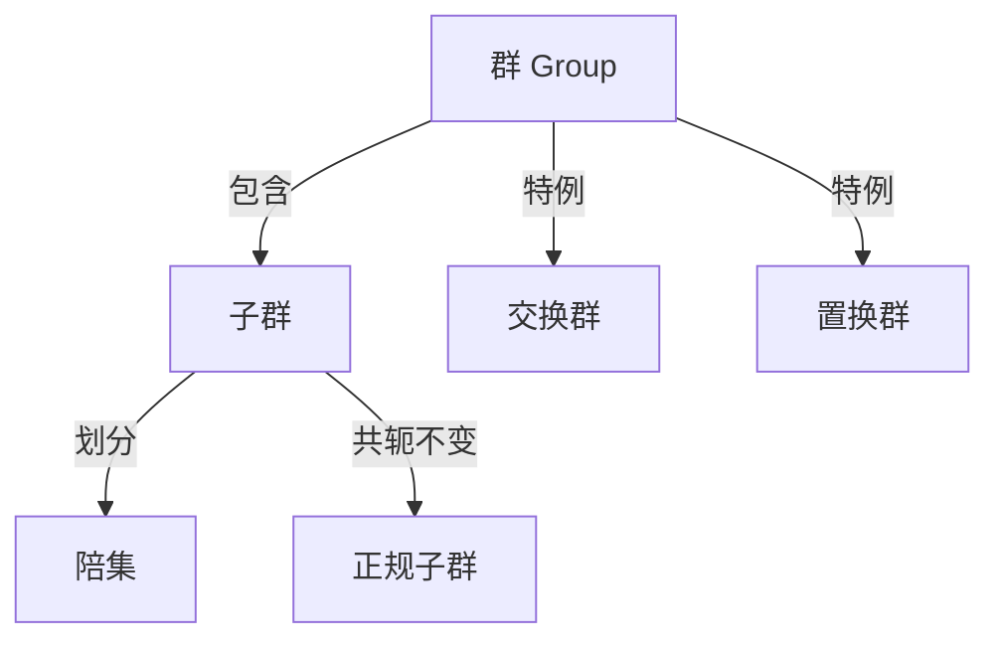

# 群的基本概念

群论是抽象代数的核心分支，研究具有一种二元运算的代数结构。

## 群的定义

设 $G$ 是一个非空集合，其上定义了一个二元运算 $\cdot$（称为乘法）。若满足以下四条公理，则称 $(G, \cdot)$ 为一个**群**：

1. **封闭性**：$\forall a, b \in G$，有 $a \cdot b \in G$
2. **结合律**：$\forall a, b, c \in G$，有 $(a \cdot b) \cdot c = a \cdot (b \cdot c)$
3. **单位元**：$\exists e \in G$，使得 $\forall a \in G$，有 $e \cdot a = a \cdot e = a$
4. **逆元**：$\forall a \in G$，$\exists a^{-1} \in G$，使得 $a \cdot a^{-1} = a^{-1} \cdot a = e$

## 基本性质

- **单位元唯一**：若 $e, e'$ 均为单位元，则 $e = e \cdot e' = e'$
- **逆元唯一**：每个元素的逆元唯一
- **消去律**：若 $ab = ac$，则 $b = c$（左消去律）；若 $ba = ca$，则 $b = c$（右消去律）

## 群的阶

- 群 $G$ 中元素的个数称为群的**阶**，记作 $|G|$
- 若 $|G|$ 有限，称 $G$ 为**有限群**；否则为**无限群**

## 元素的阶

对 $a \in G$，使得 $a^n = e$ 的最小正整数 $n$ 称为元素 $a$ 的**阶**，记作 $|a|$。若不存在这样的 $n$，则称 $a$ 的阶为无穷。

## 常见例子

| 群 | 运算 | 阶 |
|---|---|---|
| $\mathbb{Z}$ | 加法 | 无限 |
| $\mathbb{Z}_n$ | 模 $n$ 加法 | $n$ |
| $\mathbb{R}^*$ | 乘法 | 无限 |
| $GL_n(\mathbb{R})$ | 矩阵乘法 | 无限 |
| $S_n$ | 置换复合 | $n!$ |

## 子主题

- [子群](./subgroup.md)
- [陪集](./coset.md)
- [正规子群](./normal-subgroup.md)
