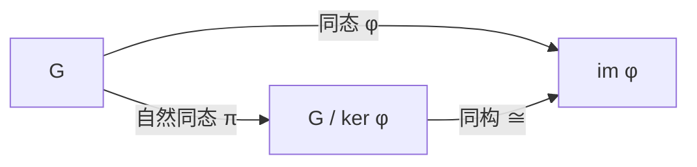
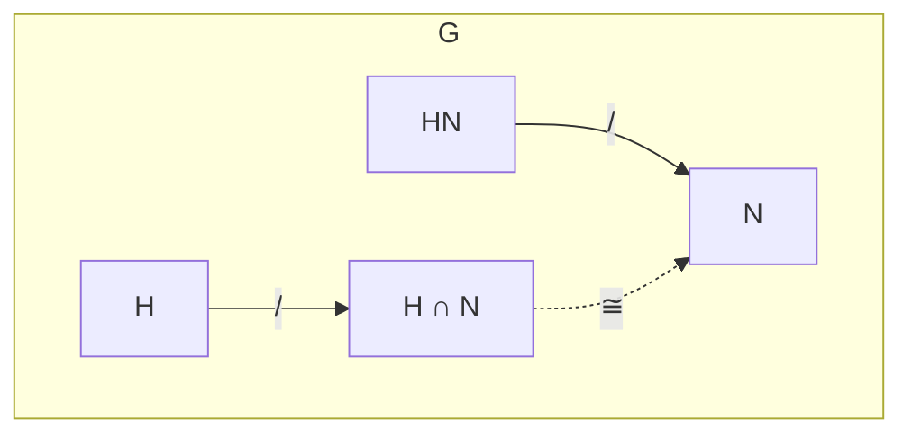

# 同态基本定理

同态基本定理（也称第一同构定理）连接了同态的核、像与商群，是群论中最核心的结构定理。

## 第一同构定理（同态基本定理）

设 $\varphi: G \to H$ 为群同态，则

$$G / \ker \varphi \cong \operatorname{im} \varphi$$

具体地，映射 $\overline{\varphi}: G/\ker\varphi \to \operatorname{im}\varphi$，$\overline{\varphi}(g\ker\varphi) = \varphi(g)$ 是良定义的同构。

## 第二同构定理（子群乘积定理）

设 $H \leqslant G$，$N \trianglelefteq G$，则：

1. $HN = \{hn \mid h \in H, n \in N\} \leqslant G$
2. $H \cap N \trianglelefteq H$
3. $$H / (H \cap N) \cong HN / N$$

## 第三同构定理（商群的商群）

设 $N \trianglelefteq G$，$M \trianglelefteq G$，且 $N \subseteq M$，则：

1. $M/N \trianglelefteq G/N$
2. $$(G/N) / (M/N) \cong G/M$$

## 对应定理（格同构定理）

设 $N \trianglelefteq G$，则存在双射：

$$\{\text{包含 }N\text{ 的子群 }H \mid N \subseteq H \leqslant G\} \longleftrightarrow \{\text{商群 }G/N\text{ 的子群}\}$$

$$H \longleftrightarrow H/N$$

且此对应保持包含关系、正规性、指数。

## 重要应用

### 1. 循环群的分类

由第一同构定理，任何循环群同构于 $\mathbb{Z}$ 或 $\mathbb{Z}_n$：

- 无限循环群 $\cong \mathbb{Z}$（$\ker = \{0\}$）
- $n$ 阶循环群 $\cong \mathbb{Z}_n$（$\ker = n\mathbb{Z}$）

### 2. 线性群

- $GL_n(\mathbb{R}) / SL_n(\mathbb{R}) \cong \mathbb{R}^*$（由行列式同态）
- $O(n) / SO(n) \cong \{\pm 1\}$

### 3. 对称群与交错群

$$S_n / A_n \cong \{\pm 1\} \cong \mathbb{Z}_2$$

## 定理之间的逻辑关系

| 定理 | 核心结论 |
|---|---|
| 第一同构定理 | $G/\ker\varphi \cong \operatorname{im}\varphi$ |
| 第二同构定理 | $H/(H\cap N) \cong HN/N$ |
| 第三同构定理 | $(G/N)/(M/N) \cong G/M$ |
| 对应定理 | 商群的子群结构 = 包含核的子群结构 |
