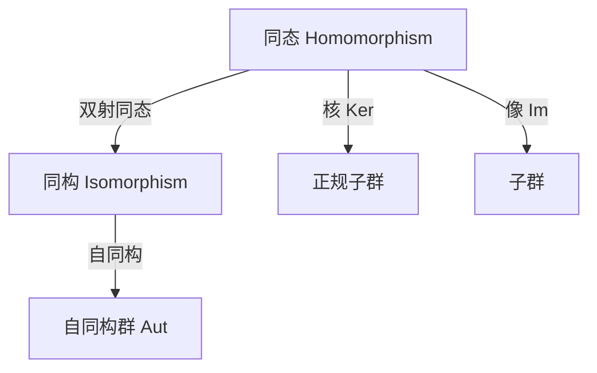

# 群同态与同构

群同态是群之间保持运算结构的映射，是研究群之间关系的核心工具。

```mermaid
graph TB
    Hom[同态 Homomorphism] -->|双射同态| Iso[同构 Isomorphism]
    Hom -->|核 Ker| NS[正规子群]
    Hom -->|像 Im| Sub[子群]
    Iso -->|自同构| Aut[自同构群 Aut]
```

## 子主题

- [群同态](./homomorphism.md)
- [群同构](./isomorphism.md)
- [同态基本定理](./fundamental-theorem.md)
