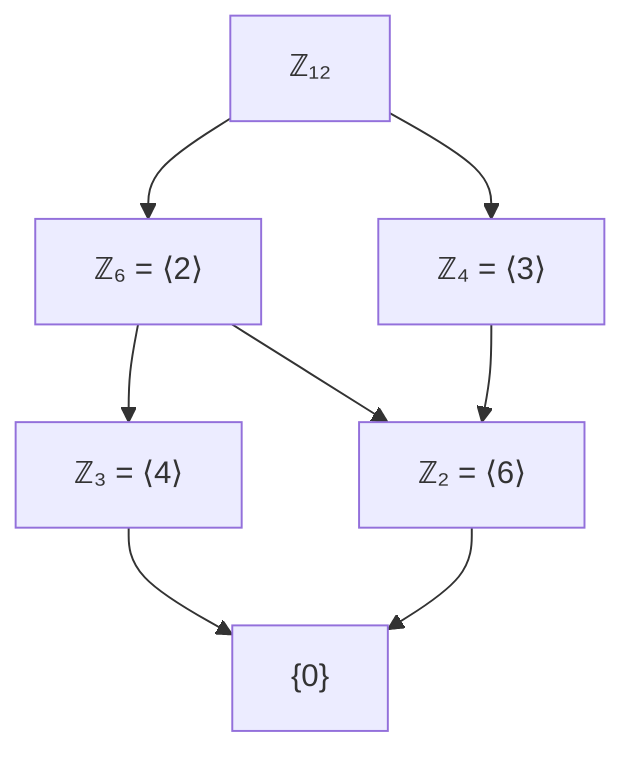

# 循环群（Cyclic Group）

## 定义

若群 $G$ 可由单个元素生成，即

$$G = \langle a \rangle = \{a^n \mid n \in \mathbb{Z}\}$$

则称 $G$ 为**循环群**，$a$ 称为其**生成元**。

循环群必为交换群：$a^m \cdot a^n = a^{m+n} = a^n \cdot a^m$

## 循环群的分类

| 类型 | 条件 | 同构于 | 生成元个数 |
|---|---|---|---|
| 无限循环群 | $|a| = \infty$ | $\mathbb{Z}$ | 2 个：$a, a^{-1}$ |
| $n$ 阶循环群 | $|a| = n$ | $\mathbb{Z}_n$ | $\varphi(n)$ 个 |

其中 $\varphi$ 为欧拉函数，$\varphi(n)$ 表示 $1 \sim n$ 中与 $n$ 互质的整数个数。

## 循环群的基本性质

1. **子群也是循环群**：循环群的子群必为循环群
2. **子群与阶一一对应**：$n$ 阶循环群 $\mathbb{Z}_n$ 的子群与 $n$ 的正因子一一对应
3. **每个因子对应唯一子群**：对 $n$ 的每个正因子 $d$，$\mathbb{Z}_n$ 有唯一的 $d$ 阶子群 $\langle a^{n/d} \rangle$
4. **元素的阶**：$\mathbb{Z}_n$ 中，$a^k$ 的阶为 $n / \gcd(n, k)$

## 生成元的判定

在 $\mathbb{Z}_n$ 中，$\overline{k}$（$1 \leqslant k \leqslant n$）是生成元当且仅当 $\gcd(k, n) = 1$。

## $\mathbb{Z}_n$ 的子群格

以 $\mathbb{Z}_{12}$ 为例：

**子群格与正因子**：$\mathbb{Z}_{12}$ 的正因子：1, 2, 3, 4, 6, 12。子群格反映了整除关系的倒置。

## 重要的循环群实例

| 实例 | 阶 | 说明 |
|---|---|---|
| $(\mathbb{Z}_n, +)$ | $n$ | 模 $n$ 加法 |
| $(U_n, \times)$ | $\varphi(n)$ | 模 $n$ 乘法群（不一定循环） |
| $n$ 次单位根群 | $n$ | $\{e^{2\pi i k/n} \mid 0 \leqslant k < n\}$ |
| 旋转群 $C_n$ | $n$ | 平面的 $n$ 次旋转 |

## 与交换群的关系

从 Mermaid 图可见：

$$\text{循环群} \subset \text{交换群} \subset \text{群}$$

循环群是最"简单"的群结构，由单个生成元完全确定。
