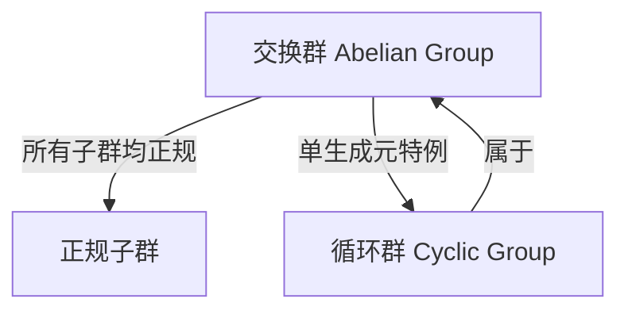

# 交换群与循环群

交换群（阿贝尔群）是最简单也最重要的群类之一，循环群则是最简单的交换群。

```mermaid
graph TB
    Abel[交换群 Abelian Group] -->|所有子群均正规| NS[正规子群]
    Abel -->|单生成元特例| Cycl[循环群 Cyclic Group]
    Cycl -->|属于| Abel
```

## 子主题

- [交换群](./abelian-group.md)
- [循环群](./cyclic-group.md)
