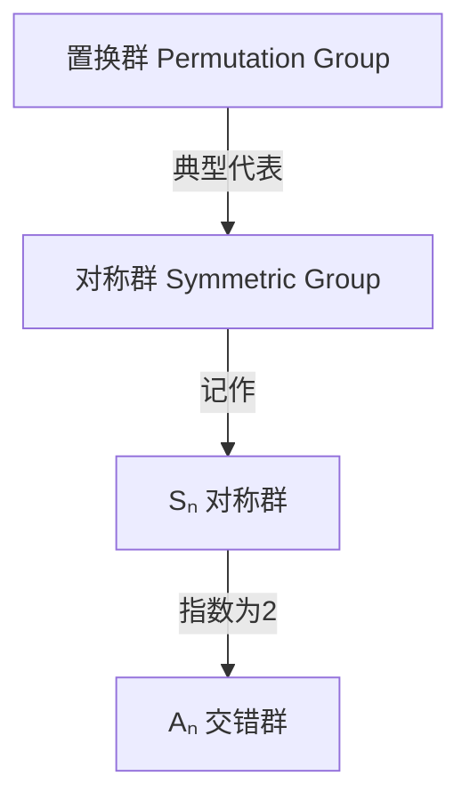

# 置换群与对称群

置换群是群论的历史起点（Galois 引入），也是 Cayley 定理的基础——任何群都可嵌入置换群。

```mermaid
graph TB
    Perm[置换群 Permutation Group] -->|典型代表| Sym[对称群 Symmetric Group]
    Sym -->|记作| Sn["Sₙ 对称群"]
    Sn -->|指数为2| An["Aₙ 交错群"]
```

## 子主题

- [置换群](./permutation-group.md)
- [对称群](./symmetric-group.md)
