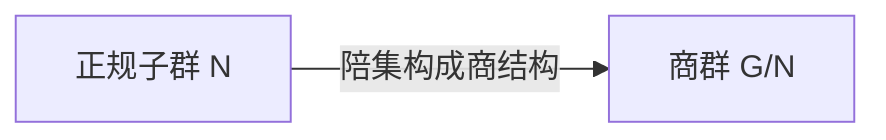

# 商群

## 来源

从 Mermaid 图中可以看到，**正规子群**的陪集构成商结构，即商群：

## 定义

设 $N \trianglelefteq G$。在 $N$ 的所有陪集的集合 $G/N = \{gN \mid g \in G\}$ 上定义乘法：

$$(aN)(bN) = (ab)N$$

则 $(G/N, \cdot)$ 构成群，称为 $G$ 对 $N$ 的**商群**（Quotient Group / Factor Group）。

## 商群的阶

由 Lagrange 定理：

$$|G/N| = [G:N] = \frac{|G|}{|N|}$$

## 良定义性

商群乘法的良定义依赖于 $N$ 的正规性：

- 若 $N$ 只是子群（不一定正规），则陪集上的该乘法未必良定义
- $N$ 正规 $\iff$ 该乘法良定义 $\iff$ $G/N$ 构成群

## 自然同态（典范投影）

映射 $\pi: G \to G/N$，$\pi(g) = gN$ 是满同态，称为**自然同态**（Natural Homomorphism）。

- $\ker \pi = N$
- $\operatorname{im} \pi = G/N$

由第一同构定理：$G/\ker\pi \cong \operatorname{im}\pi$，即 $G/N \cong G/N$（自洽）。

## 商群的性质

1. **$G/N$ 的交换性**：$G/N$ 交换 $\iff G' \subseteq N$（$G'$ 是换位子群）
2. **商群的子群**：$G/N$ 的子群形如 $H/N$，其中 $N \subseteq H \leqslant G$（对应定理）
3. **商群的正规子群**：$H/N \trianglelefteq G/N \iff H \trianglelefteq G$
4. **商群的商群**：$(G/N)/(M/N) \cong G/M$（第三同构定理）

## 常见商群例子

| 商群 | 说明 |
|---|---|
| $\mathbb{Z} / n\mathbb{Z}$ | 模 $n$ 加法群 $\mathbb{Z}_n$ |
| $S_n / A_n$ | $\cong \mathbb{Z}_2$ |
| $GL_n(\mathbb{R}) / SL_n(\mathbb{R})$ | $\cong \mathbb{R}^*$（由行列式） |
| $G / Z(G)$ | $\cong \operatorname{Inn}(G)$（内自同构群） |
| $G / G'$ | $G$ 的最大交换商群（Abelianization） |

## Abel 化

换位子群 $G' = [G, G]$ 总正规，商群 $G/G'$ 是交换群，且是所有交换商群中"最大"的。

$$G \text{ 交换 } \iff G' = \{e\} \iff G/G' \cong G$$

## 可解群

若存在正规列：

$$\{e\} = G_0 \trianglelefteq G_1 \trianglelefteq \cdots \trianglelefteq G_n = G$$

使得每个商群 $G_{i+1}/G_i$ 均为交换群，则称 $G$ 为**可解群**。

这是 Galois 理论中判别方程是否可用根式求解的关键概念。
