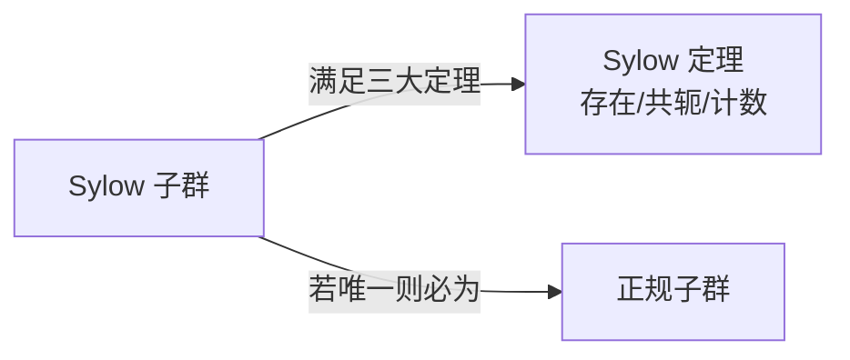

# Sylow 定理

Sylow 定理是有限群论中最重要的结构定理之一，揭示了有限群的 $p$-子群结构。

## 基本概念

### $p$-群

设 $p$ 为素数。若群 $P$ 的每个元素的阶都是 $p$ 的幂，则称 $P$ 为 **$p$-群**。

等价地：$|P| = p^k$（$k \geq 0$）。

### $p$-子群

$G$ 的子群若为 $p$-群，则称为 $G$ 的一个 **$p$-子群**。

### Sylow $p$-子群

设 $|G| = p^k \cdot m$，其中 $p \nmid m$。$G$ 中阶为 $p^k$ 的子群称为 $G$ 的一个 **Sylow $p$-子群**。

即：Sylow $p$-子群是 $G$ 的极大的 $p$-子群。

## Sylow 三大定理

### 第一定理（存在性）

> 设 $p$ 为素数，$|G| = p^k \cdot m$（$p \nmid m$），则 $G$ 存在至少一个 Sylow $p$-子群。
>
> 更一般地，对任意 $0 \leqslant i \leqslant k$，$G$ 存在 $p^i$ 阶子群。

### 第二定理（共轭性）

> $G$ 的任意两个 Sylow $p$-子群相互共轭。
>
> 即若 $P, Q$ 均为 Sylow $p$-子群，则 $\exists g \in G$，使得 $Q = gPg^{-1}$。
>
> 进一步，$G$ 的任意 $p$-子群均包含在某个 Sylow $p$-子群中。

### 第三定理（计数定理）

> 设 $n_p$ 为 $G$ 中 Sylow $p$-子群的个数，则：
>
> 1. $n_p \equiv 1 \pmod{p}$（$n_p$ 模 $p$ 余 1）
> 2. $n_p \mid m$（$n_p$ 整除 $m$，其中 $|G| = p^k \cdot m, p \nmid m$）
> 3. $n_p = [G : N_G(P)]$（$n_p$ 等于正规化子的指数）

## Sylow 子群的正规性

从 Mermaid 图中：

$$\text{Sylow 子群唯一} \implies \text{该 Sylow 子群正规模}$$

- 若 $n_p = 1$，则唯一的 Sylow $p$-子群 $P \trianglelefteq G$
- $P \trianglelefteq G \iff n_p = 1 \iff P$ 在共轭下不变

## 应用：判定群的结构

### 例 1：阶为 15 的群

$|G| = 15 = 3 \times 5$

- $n_3 \equiv 1 \pmod{3}$ 且 $n_3 \mid 5$ $\implies n_3 = 1$
- $n_5 \equiv 1 \pmod{5}$ 且 $n_5 \mid 3$ $\implies n_5 = 1$

唯一的 Sylow 3-子群和 Sylow 5-子群均正规，$G \cong \mathbb{Z}_3 \times \mathbb{Z}_5 \cong \mathbb{Z}_{15}$。

### 例 2：阶为 12 的群

$|G| = 12 = 2^2 \times 3$

- $n_3 \equiv 1 \pmod{3}$ 且 $n_3 \mid 4$ $\implies n_3 = 1 \text{ 或 } 4$
- $n_2$ 为奇数且 $n_2 \mid 3$ $\implies n_3 = 1 \text{ 或 } 3$

因此阶 12 的群不唯一（有 5 个同构类，含 $A_4$）。

## 常见非交换群的 Sylow 结构

| 群 | 阶 | Sylow 2-子群 | Sylow 3-子群 | Sylow 5-子群 |
|---|---|---|---|---|
| $S_3$ | 6 | $\mathbb{Z}_2$ ($n_2=3$) | $\mathbb{Z}_3$ ($n_3=1$) | — |
| $A_4$ | 12 | $V_4$ ($n_2=1$) | $\mathbb{Z}_3$ ($n_3=4$) | — |
| $S_4$ | 24 | $D_8$ ($n_2=3$) | $\mathbb{Z}_3$ ($n_3=4$) | — |
| $A_5$ | 60 | $V_4$ ($n_2=5$) | $\mathbb{Z}_3$ ($n_3=10$) | $\mathbb{Z}_5$ ($n_5=6$) |

## Sylow 定理的证明思路

| 定理 | 核心工具 |
|---|---|
| 第一定理 | 群作用在子集族上 + 轨道公式 |
| 第二定理 | Sylow $p$-子群在共轭作用下的轨道 |
| 第三定理 | $p$-群作用的不动点定理 + 正规化子 |
## Sylow 定理证明非单性

Sylow 定理最经典的应用是证明某阶群**不是单群**（即必存在非平凡的正规子群）。

### 基本策略

1. 对某个素数 $p$，分析 $n_p$ 的可能值
2. 若 $n_p = 1$，则 Sylow $p$-子群正规 → **存在正规子群**
3. 若 $n_p > 1$，利用 $n_p$ 的上界和 $|G|$ 的大小，考虑某个子群的指数，构造低次置换表示

### 例：证明 30 阶群不是单群

$|G| = 30 = 2 \times 3 \times 5$。

- $n_5 \equiv 1 \pmod{5}$ 且 $n_5 \mid 6$ → $n_5 = 1$ 或 $6$
- $n_3 \equiv 1 \pmod{3}$ 且 $n_3 \mid 10$ → $n_3 = 1$ 或 $10$

若 $n_5 = 1$，则 Sylow 5-子群正规 → 得证。

若 $n_5 = 6$，则 30 阶群有 6 个 Sylow 5-子群，每个为 5 阶循环群。扣除这些元素（$6 \times (5-1) = 24$ 个 5 阶元），剩余 $30 - 24 = 6$ 个元素。这 6 个元素必须包含一个 Sylow 3-子群。若 $n_3 = 10$，则需要 $10 \times (3-1) = 20$ 个 3 阶元—但只余 6 个元素，矛盾！故 $n_3 = 1$，Sylow 3-子群正规。

**结论**：任何 30 阶群必有正规的 Sylow 5-子群或正规的 Sylow 3-子群 → 不是单群。

### 例：证明 48 阶群不是单群

$|G| = 48 = 2^4 \times 3$。

$n_2 \equiv 1 \pmod{2}$ 且 $n_2 \mid 3$ → $n_2 = 1$ 或 $3$。

若 $n_2 = 1$ → Sylow 2-子群正规，得证。

若 $n_2 = 3$，考虑 $G$ 作用于 3 个 Sylow 2-子群的集合 $\operatorname{Syl}_2(G)$（共轭作用），得到同态 $\varphi: G \to S_3$。由于 $|G| = 48 > 6 = |S_3|$，$\varphi$ 的核非平凡。**核必为正规子群**。

### 例：证明 72 阶群不是单群

$|G| = 72 = 2^3 \times 3^2$。

$n_3 \equiv 1 \pmod{3}$ 且 $n_3 \mid 8$ → $n_3 = 1$ 或 $4$。

若 $n_3 = 1$ → 正规子群存在。

若 $n_3 = 4$，考虑共轭作用于 4 个 Sylow 3-子群，得 $\varphi: G \to S_4$。$|S_4| = 24 < 72$，核非平凡 → 存在正规子群。

## 置换表示法（Sylow 应用的高级技巧）

> 若 $G$ 有指数为 $n$ 的子群 $H$，则 $G$ 在 $G/H$ 上的左乘作用给出同态 $\varphi: G \to S_n$，且 $\ker \varphi \subseteq H$。

### 应用技巧

找到指数较小的子群 $H$（如 Sylow $p$-子群的正规化子），用置换表示构造同态。若 $|G|$ 无法嵌入 $S_n$（即 $|G| \nmid n!$），则该同态必有非平凡核 → 存在非平凡正规子群。

## Sylow 定理综合应用策略

| 步骤 | 操作 |
|---|---|
| 1. 因数分解 | 分解 $|G|$ 的素因数 |
| 2. 列所有 $n_p$ | 对每个 $p$，按两个条件列出 $n_p$ |
| 3. 优先找 $n_p = 1$ | 若任一 $n_p = 1$，即刻得到正规子群 |
| 4. 计数排除 | 若所有 $n_p > 1$，用元素计数推出矛盾或找到正规子群 |
| 5. 置换表示 | 若以上失败，对某个 Sylow 子群考虑置换表示 |