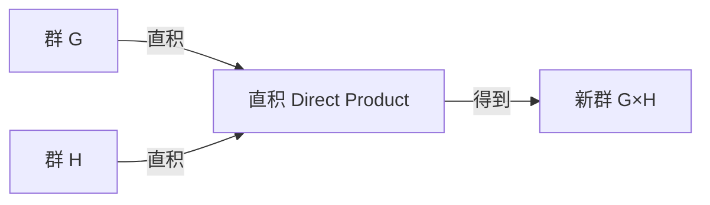

# 群的直积

直积是从已知群构造新群的基本方法。

## 外直积

### 定义

设 $G, H$ 为群。在笛卡尔积 $G \times H = \{(g, h) \mid g \in G, h \in H\}$ 上定义分量乘法：

$$(g_1, h_1) \cdot (g_2, h_2) = (g_1g_2, h_1h_2)$$

则 $(G \times H, \cdot)$ 构成群，称为 $G$ 与 $H$ 的**外直积**（External Direct Product）。

### 基本性质

| 性质 | 结果 |
|---|---|
| 单位元 | $(e_G, e_H)$ |
| 逆元 | $(g, h)^{-1} = (g^{-1}, h^{-1})$ |
| 阶 | $|G \times H| = |G| \cdot |H|$ |
| 元素 $(g, h)$ 的阶 | $\operatorname{lcm}(\lvert g \rvert, \lvert h \rvert)$ |

## 直积与正规子群

$G \times H$ 包含两个典范正规子群：

- $\widetilde{G} = \{(g, e_H) \mid g \in G\} \cong G \trianglelefteq G \times H$
- $\widetilde{H} = \{(e_G, h) \mid h \in H\} \cong H \trianglelefteq G \times H$

且 $(G \times H) / \widetilde{H} \cong G$，$(G \times H) / \widetilde{G} \cong H$。

## 内直积

### 定义

设 $N, M \trianglelefteq G$ 满足：

1. $G = NM = \{nm \mid n \in N, m \in M\}$
2. $N \cap M = \{e\}$

则称 $G$ 为 $N$ 与 $M$ 的**内直积**（Internal Direct Product），记作 $G = N \times M$。

此时 $G \cong N \times M$（同构于外直积），且 $N$ 中任意元素与 $M$ 中任意元素可交换。

## 外直积 $\cong$ 内直积

若 $G = N \times M$（内直积），则自然映射 $N \times M \to G$，$(n, m) \mapsto nm$ 是同构。

## 推广：多个群的直积

$$\prod_{i=1}^n G_i = G_1 \times G_2 \times \cdots \times G_n$$

运算逐分量进行，阶为各因子阶之积，元素的阶为各分量阶的最小公倍数。

## 有限交换群基本定理（重述）

任意有限交换群可分解为循环群的直积。这就是直积在群论中最经典的应用：

$$G \cong \mathbb{Z}_{d_1} \times \mathbb{Z}_{d_2} \times \cdots \times \mathbb{Z}_{d_r}$$

其中 $d_1 \mid d_2 \mid \cdots \mid d_r$，这些 $d_i$ 称为**不变因子**。

## 常见直积例子

| 直积 | 说明 |
|---|---|
| $\mathbb{Z}_2 \times \mathbb{Z}_2$ | Klein 四元群 $V_4$ |
| $\mathbb{Z}_2 \times \mathbb{Z}_3$ | $\cong \mathbb{Z}_6$（$\gcd(2,3)=1$） |
| $\mathbb{Z}_m \times \mathbb{Z}_n$ | $\cong \mathbb{Z}_{mn} \iff \gcd(m, n) = 1$ |
| $\mathbb{R} \times \mathbb{Z}$ | 非交换群的直积因子可产生非交换性 |
| $S_3 \times \mathbb{Z}_2$ | 阶 12 的非交换群之一 |

## 半直积（推广）

若仅有 $N \trianglelefteq G$ 和 $H \leqslant G$ 满足 $G = NH$ 且 $N \cap H = \{e\}$（但不要求 $H \trianglelefteq G$），则 $G$ 是 $N$ 和 $H$ 的**半直积**，记作 $G = N \rtimes H$。

例如：$S_n = A_n \rtimes \mathbb{Z}_2$，$D_{2n} = \mathbb{Z}_n \rtimes \mathbb{Z}_2$。
