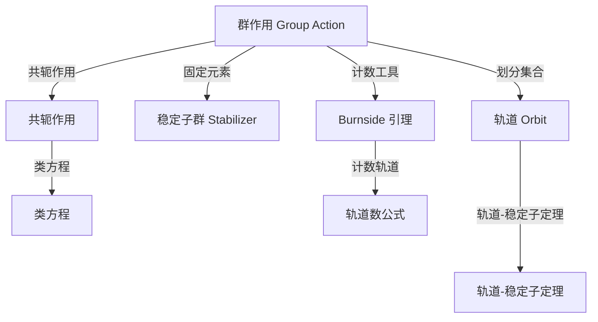

# 群在集合上的作用

群作用（Group Action）是将抽象的群与具体的几何/组合对象联系起来的桥梁。它使群"活"起来——群元素变成集合上的变换，从而可以用群论工具解决计数、对称性分类等问题。

## 定义

### 群作用

设 $G$ 为群，$X$ 为非空集合。一个 **$G$ 在 $X$ 上的（左）作用** 是一个映射：

$$\cdot : G \times X \to X, \quad (g, x) \mapsto g \cdot x$$

满足以下两个公理：

1. **单位元作用**：$\forall x \in X$，$e \cdot x = x$
2. **相容性**：$\forall g, h \in G, x \in X$，$(gh) \cdot x = g \cdot (h \cdot x)$

此时称 $X$ 为一个 **$G$-集**（$G$-set）。

**等价刻画**：群作用 $\iff$ 群同态 $\varphi: G \to \operatorname{Sym}(X)$，其中 $\varphi(g)(x) = g \cdot x$。这个视角非常有用——群作用本质上是把群元素"表示"为集合上的置换。

### 一些基本概念

| 概念 | 记号 | 定义 |
|---|---|---|
| 作用 | $g \cdot x$ | 群元素 $g$ 把 $x$ 映到某个元素 |
| 轨道 | $G \cdot x$ 或 $\operatorname{Orb}(x)$ | $\{g \cdot x \mid g \in G\}$，$x$ 在群作用下能到达的所有点 |
| 稳定子群 | $G_x$ 或 $\operatorname{Stab}(x)$ | $\{g \in G \mid g \cdot x = x\}$，固定 $x$ 不动的群元素 |
| 不动点集 | $X^g$ | $\{x \in X \mid g \cdot x = x\}$，被 $g$ 固定的元素 |
| 核 | $\ker \varphi$ | 对 $\forall x$ 均作用为恒等的 $g$ 的集合 |
| 忠实作用 | — | $\ker \varphi = \{e\}$，即只有单位元平凡作用 |
| 传递作用 | — | $\forall x, y \in X$，$\exists g \in G$ 使 $g \cdot x = y$（只有一个轨道） |

## 常见例子

### 1. 置换群的自然作用

对称群 $S_n$ 自然作用于 $\{1, 2, \ldots, n\}$：
$$\sigma \cdot i = \sigma(i)$$

这是最本质的群作用，Cayley 定理的本质就是任意群可以嵌入某个对称群的作用中。

### 2. 群在自身上的左乘作用

任意群 $G$ 作用于自身：
$$g \cdot x = gx$$

这个作用是传递的、忠实的。由此可得 **Cayley 定理**：$G$ 同构于 $\operatorname{Sym}(G)$ 的某个子群。

### 3. 共轭作用

$G$ 作用于自身：
$$g \cdot x = gxg^{-1}$$

- 轨道 = 共轭类 $\{gxg^{-1} \mid g \in G\}$
- 稳定子群 = 中心化子 $C_G(x) = \{g \in G \mid gx = xg\}$
- 不动点集 $G^g$ 中的元素是与 $g$ 交换的元素

### 4. 陪集空间上的作用

$G$ 作用于商集 $G/H$（$H \leqslant G$）：
$$g \cdot (aH) = (ga)H$$

这个作用总是传递的。任何传递作用本质上都同构于这种形式。

### 5. 几何作用

二面体群 $D_{2n}$ 作用于正 $n$ 边形的顶点集：
- 旋转：$r \cdot v_i = v_{i+1 \bmod n}$
- 反射：$s \cdot v_i = v_{-i \bmod n}$

**本章结构**：
- [轨道与稳定子定理](./orbit.md) — 轨道划分、轨道-稳定子定理及其推论
- [Burnside 引理](./burnside.md) — 计数轨道数的核心工具及项链计数应用
- [类方程](./class-equation.md) — 共轭作用导出的类方程与 $p$-群应用
- [群作用的进一步应用](./applications.md) — 与 Sylow 定理、Cayley 定理、半直积的联系
