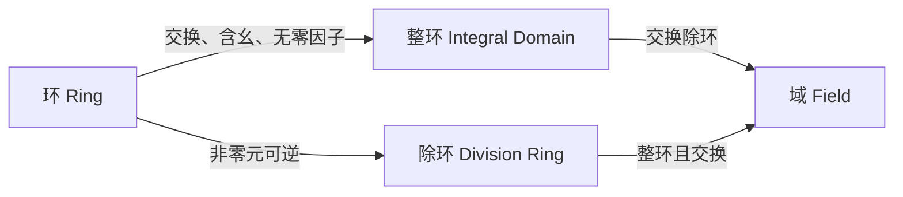

# 环的基本概念

环（Ring）是抽象代数中最基本的代数结构之一，具有两种二元运算——加法和乘法。从整数的算术性质到多项式理论，环的概念无处不在。

```mermaid
graph LR
    R[环 Ring] -->|交换、含幺、无零因子| ID[整环 Integral Domain]
    R -->|非零元可逆| Div[除环 Division Ring]
    ID -->|交换除环| Field[域 Field]
    Div -->|整环且交换| Field
```

## 子主题

- [环的定义与基本性质](./ring-definition.md)
- [整环](./integral-domain.md)
- [域](./field.md)
