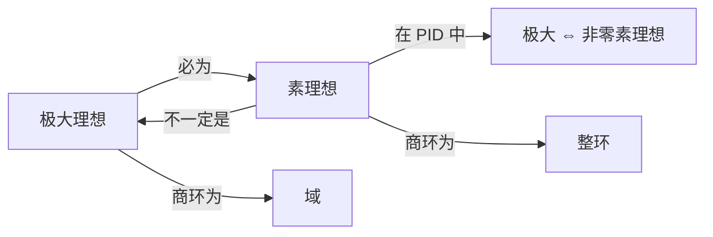

# 理想的类型

理想按照生成方式和商环的性质分为主理想、素理想和极大理想等类型。它们之间的关系是环结构理论的核心。

## 主理想

### 定义

由一个元素生成的理想称为**主理想**。在交换含幺环中，$a$ 生成的主理想为：

$$(a) = \{ra \mid r \in R\}$$

### 主理想整环（PID）

若整环的每个理想都是主理想，则称为**主理想整环**（Principal Ideal Domain）。

| PID | 说明 |
|---|---|
| $\mathbb{Z}$ | 所有理想形如 $(n)$ |
| $F[x]$（$F$ 为域） | 所有理想形如 $(f(x))$ |
| $\mathbb{Z}[i]$ | 高斯整数环 |

**非 PID 的例子**：$F[x, y]$ 不是 PID——理想 $(x, y)$ 不能由一个元素生成。$2\mathbb{Z}[x] + x\mathbb{Z}[x]$ 也不是主理想。

## 素理想

### 定义

设 $P$ 为交换环 $R$ 的真理想（$P \neq R$）。若满足：

$$ab \in P \Longrightarrow a \in P \ \text{或}\ b \in P$$

则称 $P$ 为 $R$ 的**素理想**。

**与素数类比**：素数 $p$ 满足 $p \mid ab \Rightarrow p \mid a$ 或 $p \mid b$；素理想 $(p)$ 满足 $ab \in (p) \Rightarrow a \in (p)$ 或 $b \in (p)$。完全相同的思想！

### 素理想的判定

> **定理**：设 $P$ 为交换环 $R$ 的理想。则 $P$ 是素理想 $\iff$ $R/P$ 是整环。

### 常见例子

| 素理想 | 环 | 商环 |
|---|---|---|
| $(p)$（$p$ 素数） | $\mathbb{Z}$ | $\mathbb{Z}_p$（域） |
| $(x)$ | $F[x]$ | $F$（域） |
| $(x, y)$ | $F[x, y]$ | $F$（域） |
| $(0)$ | 任意整环 | 整环自身 |

## 极大理想

### 定义

设 $M$ 为环 $R$ 的真理想。若不存在理想 $I$ 使 $M \subsetneq I \subsetneq R$，则称 $M$ 为 $R$ 的**极大理想**。

### 极大理想的判定

> **定理**：设 $M$ 为交换含幺环 $R$ 的理想。则 $M$ 是极大理想 $\iff$ $R/M$ 是域。

### 极大理想的存在性

任意含幺交换环 $R \neq \{0\}$ 必有极大理想（Zorn 引理）。

### 常见例子

| 极大理想 | 环 | 商环 |
|---|---|---|
| $(p)$（$p$ 素数） | $\mathbb{Z}$ | $\mathbb{Z}_p$（域） |
| $(x - a)$ | $F[x]$ | $F$（域） |
| $(x, y)$ | $F[x, y]$ | $F$（域） |
| 核的最大化 | $C[0, 1]$ | $\cong \mathbb{C}$（Gelfand-Mazur） |

## 三种理想的关系

> **定理**：极大理想 $\implies$ 素理想（在交换含幺环中）。反之不一定成立。

- 在 $\mathbb{Z}$ 中，非零素理想恰为极大理想
- 在 $F[x, y]$ 中，$(x)$ 是素理想但不是极大理想（商环 $F[y]$ 是整环但不是域）

## 总结对比

| 理想类型 | 核心条件 | 商环性质 |
|---|---|---|
| 主理想 | 由一个元素生成 | — |
| 素理想 | $ab \in P \Rightarrow a \in P$ 或 $b \in P$ | 整环 |
| 极大理想 | 没有严格包含它的真理想 | 域 |
