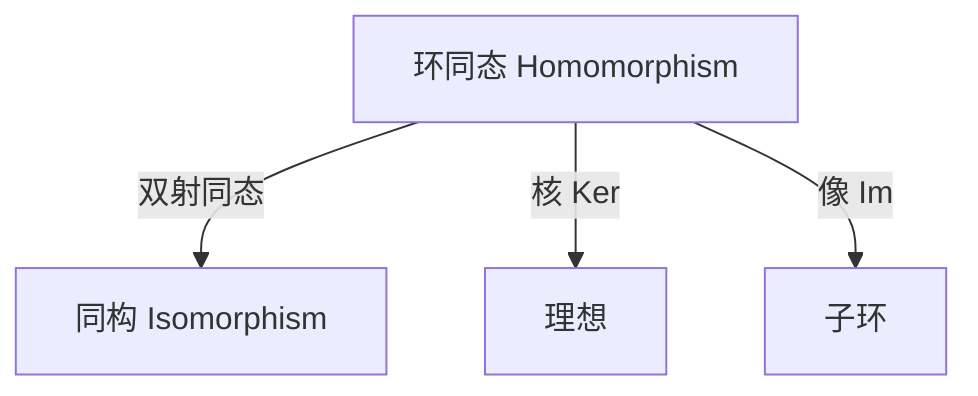

# 环同态与同构

环同态是保持两种运算的映射，是研究环之间关系的核心工具。环同态的核是理想——这正是理想概念的来源。

```mermaid
graph TB
    Hom[环同态 Homomorphism] -->|双射同态| Iso[同构 Isomorphism]
    Hom -->|核 Ker| Ideal[理想]
    Hom -->|像 Im| Sub[子环]
```

## 子主题

- [环同态](./homomorphism.md)
- [环同构](./isomorphism.md)
- [同态基本定理](./fundamental-theorem.md)
