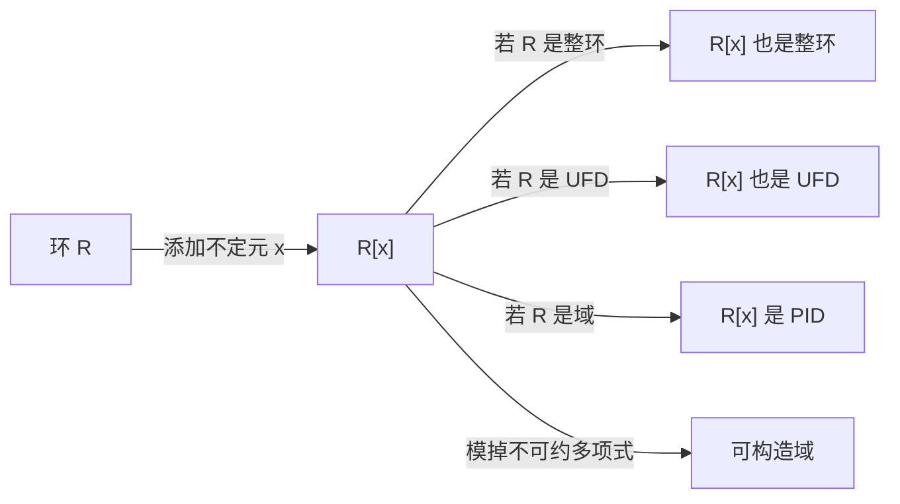

# 多项式环

多项式环（Polynomial Ring）是环论中最重要的一类环。在环 $R$ 上形式地添加一个不定元 $x$，就得到一元多项式环 $R[x]$。

## 定义

设 $R$ 为环。**一元多项式环** $R[x]$ 定义为所有形式表达式的集合：

$$R[x] = \left\{ \sum_{i=0}^{n} a_i x^i \;\middle|\; a_i \in R, n \geq 0 \right\}$$

其中加法按系数逐项相加，乘法由 $x^i \cdot x^j = x^{i+j}$ 及分配律决定。

## 多项式的次数

设 $f(x) = a_n x^n + \cdots + a_1 x + a_0 \neq 0$，其中 $a_n \neq 0$。则 $f$ 的**次数** $\deg f = n$。

- 常数项非零的多项式次数为 $0$
- 习惯上 $\deg 0 = -\infty$（或未定义）
- **$\deg(fg) = \deg f + \deg g$**（当 $R$ 是整环时）
- 若 $R$ 有零因子，上式可能不成立

## $R[x]$ 的基本性质

| $R$ 的性质 | $R[x]$ 的性质 |
|---|---|
| 交换环 | 交换环 |
| 含幺环 | 含幺环 |
| 整环 | 整环 |
| UFD | UFD（Gauss 引理） |
| PID 且 $R$ 是域 | PID |
| 域 | PID（且可做带余除法） |

**注意**：$R$ 是 PID 不一定推出 $R[x]$ 是 PID！例如 $\mathbb{Z}$ 是 PID，但 $\mathbb{Z}[x]$ 不是 PID。

## 域上多项式环的特殊性质

当 $F$ 是域时，$F[x]$ 有非常好的性质：

### 带余除法（Euclidean Algorithm）

设 $f, g \in F[x]$，$g \neq 0$。则存在唯一的 $q, r \in F[x]$ 使：

$$f = qg + r, \quad \deg r < \deg g$$

### $F[x]$ 是 PID 且是欧几里得环

$F[x]$ 中的理想均由某项多项式 $d(x)$ 生成：$(d(x))$。最大公因式可由欧几里得算法求得。

### 不可约多项式与素理想

$f(x)$ 在 $F[x]$ 中不可约 $\iff$ $(f(x))$ 是极大理想 $\iff$ $F[x]/(f(x))$ 是域。

## 多元多项式环

$$R[x_1, x_2, \ldots, x_n] = R[x_1][x_2]\cdots[x_n]$$

多元多项式环不一定是 PID。例如 $F[x, y]$ 中 $(x, y)$ 不是主理想。

## 多项式环的例子

| 多项式环 | 性质 | 说明 |
|---|---|---|
| $\mathbb{Z}[x]$ | UFD，非 PID | 整系数多项式 |
| $\mathbb{Q}[x]$ | PID，欧几里得环 | 有理系数多项式 |
| $\mathbb{R}[x]$ | PID | $(x^2 + 1)$ 是极大理想 |
| $\mathbb{F}_p[x]$ | PID | 有限域上多项式，可构造扩域 |
| $\mathbb{Z}[i] \cong \mathbb{Z}[x]/(x^2 + 1)$ | PID | 高斯整数环 |
