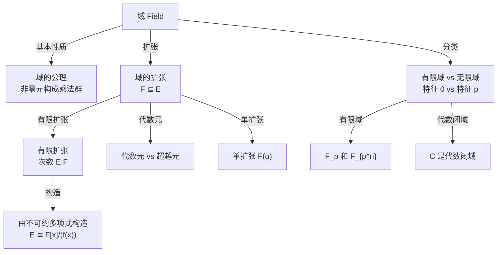

# 域论

域（Field）是环论中最"完美"的结构——每个非零元都有乘法逆元。域论以域的基本性质和扩张理论为核心，连接代数方程、Galois 理论和有限域。

## 章节导航

### 一、域的基本概念与例子

域的定义、子域与扩域、素域、特征。常见域的例子：$\mathbb{Q}, \mathbb{R}, \mathbb{C}, \mathbb{F}_p$。

- [域的定义与基本性质](./field-basics/definition-and-examples)
- [素域与特征](./field-basics/prime-field-characteristic)

### 二、域的扩张

域的代数扩张与超越扩张。有限扩张的次数公式、单扩张的构造以及由不可约多项式 $f(x)$ 构造扩域 $F[x]/(f(x))$（核心考点）。

- [代数扩张](./field-extensions/algebraic-extensions)
- [单扩张与构造扩域](./field-extensions/simple-extensions)

### 三、有限域

有限域 $\mathbb{F}_q$（$q = p^n$）的结构。存在性与唯一性，Galois 自同构（Frobenius 映射）。

- [有限域的结构](./finite-fields/structure)
