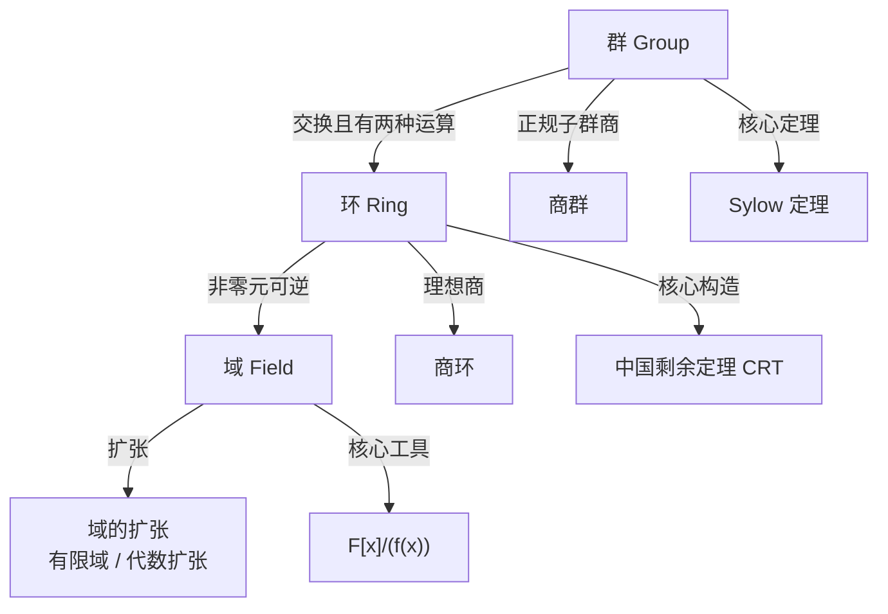

# 近世代数

近世代数（抽象代数）研究群、环、域三种基本代数结构。群具有一种运算，以对称性为研究核心；环具有两种运算，以理想和商结构为研究核心；域是环的最完美特例——非零元均可逆，是 Galois 理论的基础。

## 章节导航

### [一、群论](./group-theory/)

群具有一种二元运算。以子群、正规子群和商群为基本结构，Sylow 定理揭示有限群的 $p$-子群规律，群作用连接抽象群与具体对称。

- [群论总览](./group-theory/)
- [子群乘积与正规子群验证](./group-theory/basic-concepts/subgroup-product)

### [二、环论](./ring-theory/)

环具有加法和乘法两种运算。理想是环论的核心——它类比正规子群，使商环的构造成为可能。素理想和极大理想决定了商环的性质。

- [环论总览](./ring-theory/)
- [极大理想求法、根理想与 CRT](./ring-theory/subring-ideal/radical-crt-maximal)

### [三、域论](./field-theory/)

域是每个非零元都可逆的交换环。域的扩张理论是 Galois 理论的基石——有限域和由不可约多项式构造的扩域是核心对象。

- [域论总览](./field-theory/)
- [素域与特征](./field-theory/field-basics/prime-field-characteristic)
- [代数扩张](./field-theory/field-extensions/algebraic-extensions)
- [构造扩域 $F[x]/(f(x))$](./field-theory/field-extensions/simple-extensions)
- [有限域](./field-theory/finite-fields/structure)
