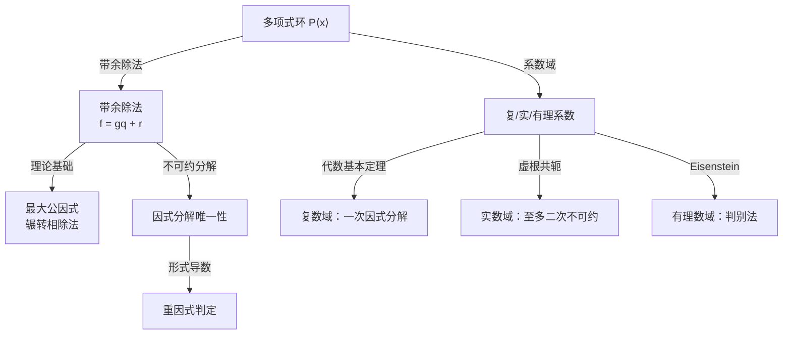

---
sidebar_position: 1
---

# 多项式

多项式是高等代数的起点。从数域和带余除法出发，逐步建立整除理论、最大公因式、因式分解唯一性、重因式判定，以及复/实/有理系数多项式的特殊性质。

## 子主题

- [数域与带余除法](./division-algorithm.md)
- [最大公因式与因式分解](./gcd-factorization.md)
- [重因式与有理系数判别](./repeated-roots-eisenstein.md)
