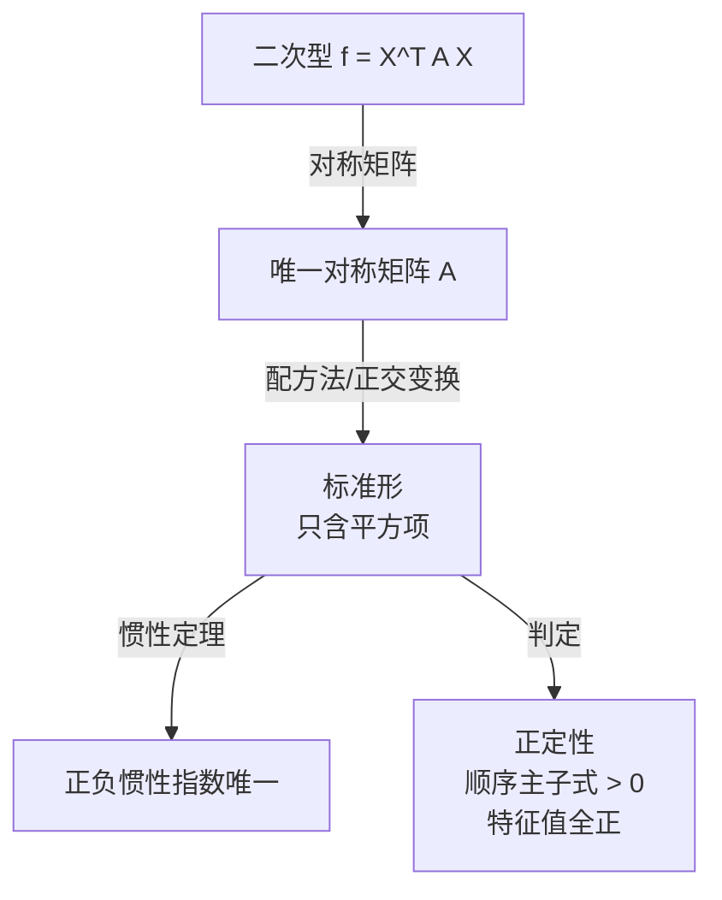

---
sidebar_position: 1
---

# 二次型

二次型是将二次齐次多项式与对称矩阵联系起来的桥梁。其核心是化成标准形、惯性定理（正负惯性指数唯一）以及正定性判定。

```mermaid
graph TB
    QF[二次型 f = X^T A X] -->|对称矩阵| SymA[唯一对称矩阵 A]
    SymA -->|配方法/正交变换| Standard[标准形<br/>只含平方项]
    Standard -->|惯性定理| Inertia[正负惯性指数唯一]
    Standard -->|判定| Positive[正定性<br/>顺序主子式 > 0<br/>特征值全正]
```

## 子主题

- [矩阵表示与标准形](./matrix-standard-form.md)
- [惯性定理与正定性](./inertia-positive-definite.md)
