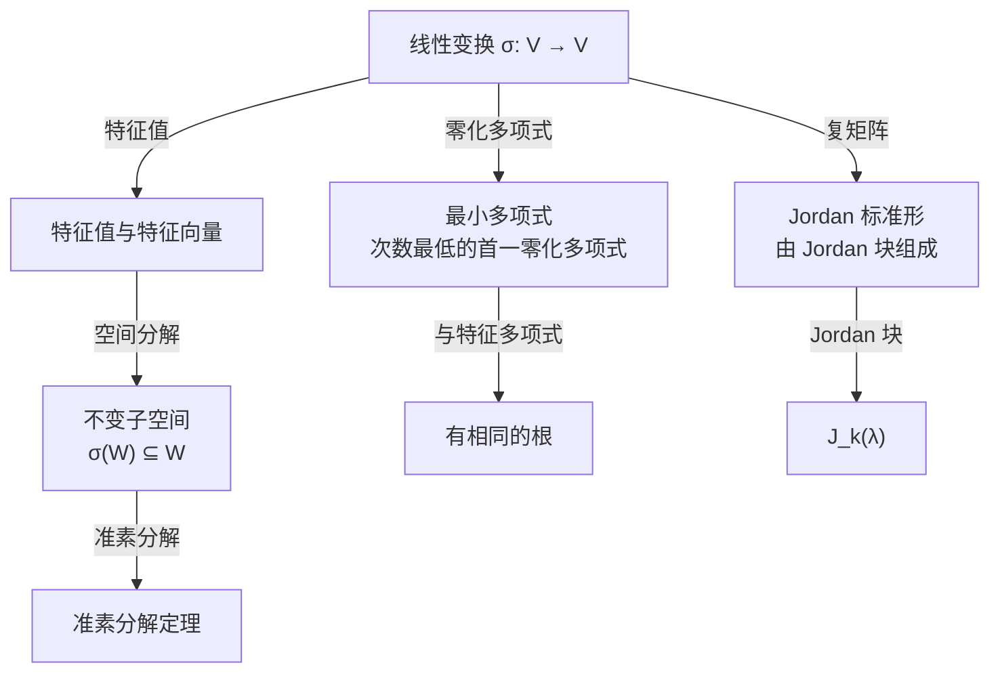

---
sidebar_position: 1
---

# 线性变换

线性变换是从线性空间到自身的线性映射，是高等代数的核心。本章重点涵盖不变子空间（空间分解）、Jordan 标准形（复矩阵的相似最简形）和最小多项式。

## 子主题

- [不变子空间](./invariant-subspace.md)
- [Jordan 标准形](./jordan-form.md)
- [最小多项式](./minimal-polynomial.md)
