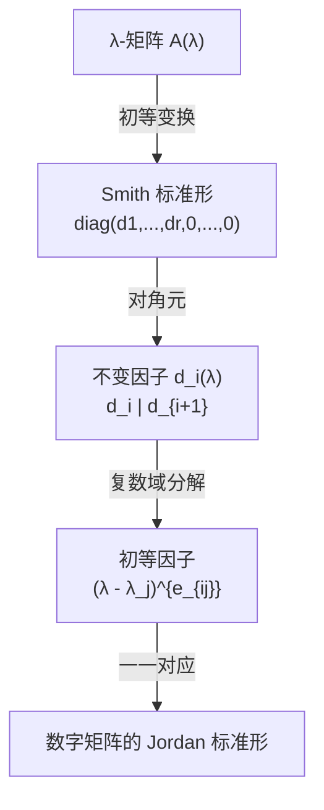

---
sidebar_position: 1
---

# λ-矩阵

λ-矩阵是以多项式为元素的矩阵。其初等变换下的 Smith 标准形引出了**不变因子**和**初等因子**，后者唯一决定了数字矩阵的 Jordan 标准形——这是代数中最漂亮的理论链条之一。

## 子主题

- [Smith 标准形与不变因子](./smith-invariant-factor.md)
- [初等因子与 Jordan 标准形推导](./elementary-factor-jordan.md)
