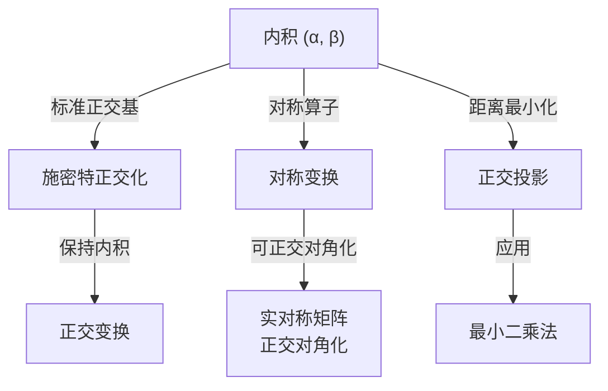

---
sidebar_position: 1
---

# 欧几里得空间

欧氏空间是带有内积的实线性空间。内积赋予了空间"长度"和"角度"的概念，使正交变换、实对称矩阵对角化、向量到子空间的距离等几何概念有了代数表述。

## 子主题

- [标准正交基与正交变换](./orthogonal-basis-transform.md)
- [向量到子空间的距离](./distance-to-subspace.md)
