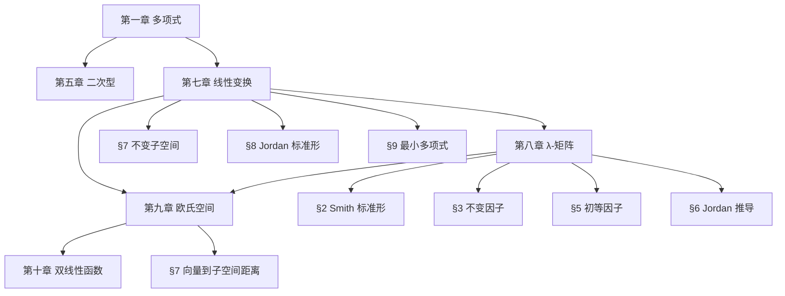

---
sidebar_position: 0
---

# 高等代数

高等代数以多项式、矩阵和线性空间为三大支柱。从多项式理论和二次型出发，逐步深入到线性变换的不变子空间、Jordan 标准形和 λ-矩阵理论，最终在欧氏空间中融合几何直觉与代数结构。

## 章节导航

### [一、多项式](./polynomial/)

数域、带余除法、辗转相除法求最大公因式、因式分解唯一性定理、重因式判定，以及复/实/有理系数多项式的特殊性质（代数基本定理、Eisenstein 判别法）。

- [数域与带余除法](./polynomial/division-algorithm)
- [最大公因式与因式分解](./polynomial/gcd-factorization)
- [重因式与有理系数判别](./polynomial/repeated-roots-eisenstein)

### [二、二次型](./quadratic-form/)

二次齐次多项式与对称矩阵的一一对应。配方法和正交变换法化标准形，惯性定理（正负惯性指数唯一），正定性判定（顺序主子式、特征值）。

- [矩阵表示与标准形](./quadratic-form/matrix-standard-form)
- [惯性定理与正定性](./quadratic-form/inertia-positive-definite)

### [三、线性变换](./linear-transformation/)

线性变换的结构理论：不变子空间与空间分解（准素分解）、Jordan 标准形（复矩阵相似最简形）以及最小多项式（次数最低的零化多项式）。

- [不变子空间](./linear-transformation/invariant-subspace)
- [Jordan 标准形](./linear-transformation/jordan-form)
- [最小多项式](./linear-transformation/minimal-polynomial)

### [四、λ-矩阵](./lambda-matrix/)

以多项式为元素的矩阵，初等变换下的 Smith 标准形引出不变因子和初等因子。初等因子唯一决定数字矩阵的 Jordan 标准形——全程理论推导链。

- [Smith 标准形与不变因子](./lambda-matrix/smith-invariant-factor)
- [初等因子与 Jordan 标准形推导](./lambda-matrix/elementary-factor-jordan)

### [五、欧几里得空间](./euclidean-space/)

内积空间中的几何。标准正交基（施密特正交化）、正交变换与实对称矩阵的正交对角化，以及向量到子空间的最短距离（正交投影）与最小二乘法。

- [标准正交基与正交变换](./euclidean-space/orthogonal-basis-transform)
- [向量到子空间的距离](./euclidean-space/distance-to-subspace)

### [六、双线性函数](./bilinear-function/)

内积的推广。线性函数与对偶空间、对称与反对称双线性函数，以及非退化反对称双线性函数引导出的辛空间概念。

## 重点模块深度解析

### 不变因子 → 初等因子 → Jordan 标准形

这是七八两章的核心逻辑链：

1. **λ-矩阵** → 初等变换 → **Smith 标准形**（对角形）
2. **不变因子** $d_i(\lambda)$：标准形对角元，有整除关系 $d_1 \mid d_2 \mid \cdots \mid d_r$
3. **初等因子**：每个 $d_i$ 在复数域分解为 $(\lambda - \lambda_j)^{e_{ij}}$，得到初等因子组
4. **Jordan 标准形**：每个初等因子 $(\lambda - \lambda_0)^k$ 对应一个 $k$ 阶 Jordan 块

$$J_k(\lambda_0) = \left(\begin{array}{cccc} \lambda_0 & 1 & & \\ & \lambda_0 & \ddots & \\ & & \ddots & 1 \\ & & & \lambda_0 \end{array}\right)_{k \times k}$$

**初等因子组完全相同是矩阵相似的充要条件。**

### 向量到子空间的距离

几何意义：$\alpha$ 到子空间 $W$ 的最短距离 $= \|\alpha - \beta\|$，$\beta$ 是 $\alpha$ 在 $W$ 上的**正交投影**。

若有标准正交基 $\varepsilon_1, \ldots, \varepsilon_m$：

$$\beta = \sum_{i=1}^{m} (\alpha, \varepsilon_i)\varepsilon_i, \quad d = \|\alpha - \beta\|$$

应用：解不相容方程组 $Ax = b$ 的最小二乘解，等价于 $b$ 在 $A$ 列空间上的正交投影，正规方程为 $A^\top A x = A^\top b$。