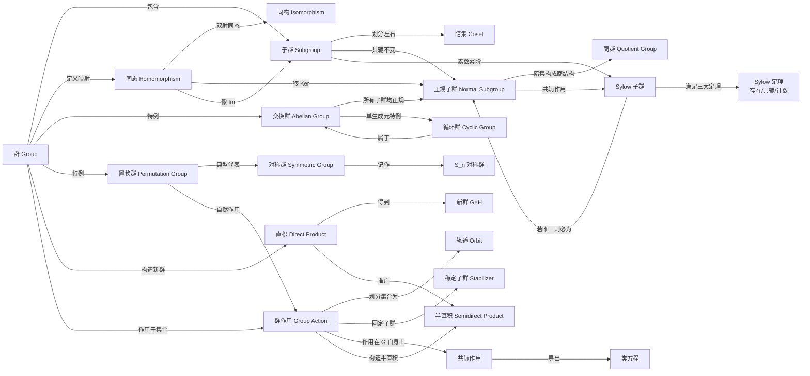

# 群论

群论（Group Theory）是抽象代数的核心分支，研究具有一种二元运算的代数结构——群。它起源于 Galois 对多项式方程可解性的研究，如今已成为数学和物理的基础语言。

## 知识体系总览

## 章节导航

### [一、群的基本概念](./01-basic-concepts/)

从群的公理化定义出发，介绍子群、陪集、Lagrange 定理和正规子群等核心基础概念。

- [群的定义与基本性质](./01-basic-concepts/)
- [子群](./01-basic-concepts/subgroup.md)
- [陪集与 Lagrange 定理](./01-basic-concepts/coset.md)
- [正规子群](./01-basic-concepts/normal-subgroup.md)

### [二、群同态与同构](./02-homomorphism/)

研究群之间保持结构的映射——同态，以及由此引申的同构概念和四大同构定理。

- [群同态](./02-homomorphism/homomorphism.md)
- [群同构](./02-homomorphism/isomorphism.md)
- [同态基本定理](./02-homomorphism/fundamental-theorem.md)

### [三、交换群与循环群](./03-abelian-cyclic/)

研究最简单的群类——交换群（阿贝尔群），特别是可由单个元素生成的循环群。

- [交换群（阿贝尔群）](./03-abelian-cyclic/abelian-group.md)
- [循环群](./03-abelian-cyclic/cyclic-group.md)

### [四、置换群与对称群](./04-permutation/)

置换群是群论的历史起点，对称群 $S_n$ 是最重要的有限群之一。Cayley 定理揭示任意群都可嵌入对称群。

- [置换群](./04-permutation/permutation-group.md)
- [对称群 $S_n$](./04-permutation/symmetric-group.md)

### [五、商群](./05-quotient-group/)

由正规子群的陪集构造商群，是群论的核心构造方法，也是同态基本定理的自然产物。

### [六、Sylow 定理](./06-sylow/)

Sylow 三大定理揭示了有限群中 $p$-子群的存在性、共轭性和计数规律，是有限群结构分析的基石。

### [七、群的直积](./07-direct-product/)

利用已知群通过直积构造新群，包含外直积、内直积以及半直积的推广。

### [八、群在集合上的作用](./08-group-action/)

群作用是连接抽象群与具体对象的桥梁。涵盖轨道、稳定子群、轨道-稳定子定理、Burnside 引理、类方程及共轭作用等核心工具。

- [群在集合上的作用](./08-group-action/)
- [轨道与稳定子定理](./08-group-action/orbit.md)
- [Burnside 引理](./08-group-action/burnside.md)
- [类方程](./08-group-action/class-equation.md)
- [群作用的进一步应用](./08-group-action/applications.md)