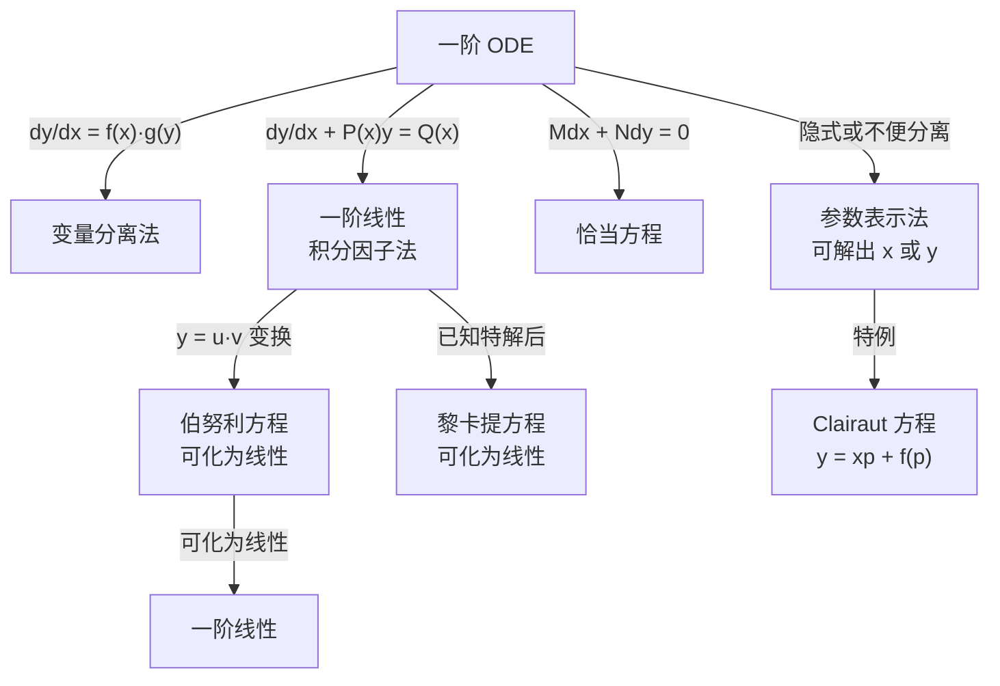

# 一阶 ODE 解法

一阶常微分方程是最基础也是最重要的一类 ODE。掌握变量分离、积分因子和恰当方程三大工具，并学会如何将伯努利、黎卡提等特殊非线性方程化归为线性方程来求解。

## 子主题

- [变量分离、齐次与恰当方程](./separable-homogeneous-exact.md)
- [一阶线性方程（积分因子法）](./linear-first-order.md)
- [伯努利方程与黎卡提方程](./bernoulli-riccati.md)
- [参数表示法](./parametric-form.md)
