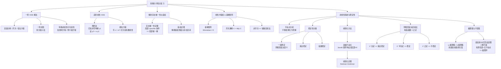

---
sidebar_position: 0
---

# 常微分方程（ODE）

常微分方程（Ordinary Differential Equations, ODE）研究未知函数及其导数之间的关系。它是数学分析的核心分支，也是物理、工程、生物、经济等领域建模的基本语言。

## 知识体系逻辑

1. **前两章（一阶 + 高阶）**：教你**怎么把解算出来**。一阶有伯努利方程，高阶有降阶法和欧拉方程，核心是"化陌生为熟悉"。
2. **中间理论（存在性与延拓）**：告诉你**算出来的解合不合理、能延拓多远**，它是所有 ODE 的理论地基。
3. **线性方程组（基解矩阵）**：从"解一个方程"推广到"解一个方程组"，核心工具是基解矩阵和常数变易公式。
4. **非线性与稳定性**：绝大多数非线性方程**算不出解析解**，于是转为**定性分析**。核心思路是"局部线性化"（双曲不动点）或"构造能量函数"（李雅普诺夫），最终用庞加莱-本尼克松定理判断是否会形成稳定的**极限环**。

## 章节导航

### [一、一阶 ODE 解法](./first-order/)

变量分离、齐次方程、恰当方程，以及一阶线性方程的积分因子法和伯努利、黎卡提等可化为线性的特殊非线性方程。

- [变量分离、齐次与恰当方程](./first-order/separable-homogeneous-exact)
- [一阶线性方程（积分因子法）](./first-order/linear-first-order)
- [伯努利方程与黎卡提方程](./first-order/bernoulli-riccati)

### [二、高阶线性 ODE](./higher-order/)

高阶线性方程的降阶法（已知一个特解求通解）和欧拉方程（通过变量替换化为常系数线性方程）。

- [降阶法](./higher-order/reduction-of-order)
- [欧拉方程](./higher-order/euler-equation)

### [三、解的存在唯一性与延拓](./existence/)

ODE 的理论基石——Picard 存在唯一性定理（局部 Lipschitz 条件保证局部唯一解）以及解的延拓定理。

### [四、线性方程组与基解矩阵](./linear-systems/)

从标量方程推广到向量方程，核心是基解矩阵 $\Phi(t)$ 和常数变易公式。

- [基解矩阵与齐次通解](./linear-systems/fundamental-matrix)
- [常数变易法](./linear-systems/variation-of-constants)

### [五、非线性系统与稳定性](./stability/)

非线性系统通常无法求出解析解，转而进行定性分析。涵盖不动点分析、线性化方法（Hartman-Grobman 定理）、李雅普诺夫直接法以及极限集与庞加莱-本尼克松定理。

- [不动点与线性化方法](./stability/fixed-points-linearization)
- [李雅普诺夫直接法](./stability/lyapunov)
- [极限集与极限环](./stability/limit-cycles)
