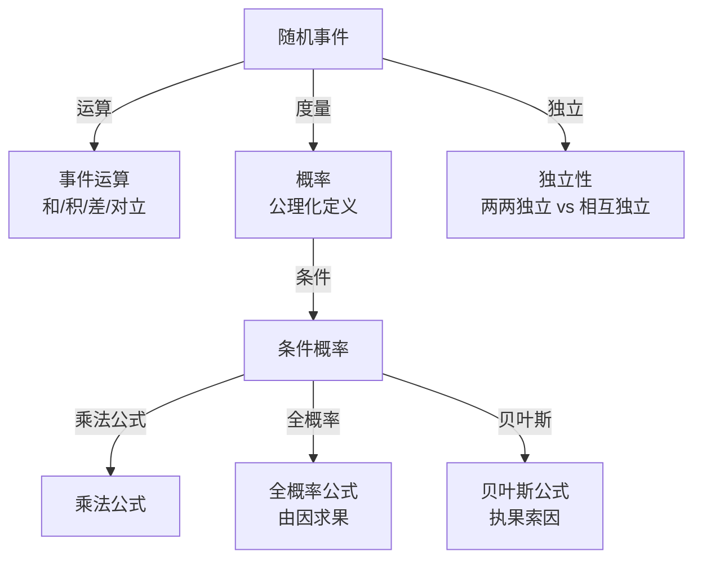

# 随机事件与概率

概率论的第一章建立了整个学科的基本语言和工具：从事件运算、概率公理化定义，到条件概率、全概率公式和贝叶斯公式，以及事件的独立性。

```mermaid
graph TB
    Event[随机事件] -->|运算| Op[事件运算<br/>和/积/差/对立]
    Event -->|度量| Prob[概率<br/>公理化定义]
    Prob -->|条件| Cond[条件概率]
    Cond -->|乘法公式| Mult[乘法公式]
    Cond -->|全概率| Total[全概率公式<br/>由因求果]
    Cond -->|贝叶斯| Bayes[贝叶斯公式<br/>执果索因]
    Event -->|独立| Indep[独立性<br/>两两独立 vs 相互独立]
```

## 子主题

- [事件运算与概率定义](./event-probability.md)
- [条件概率与三大公式](./conditional-probability.md)
- [独立性](./independence.md)
