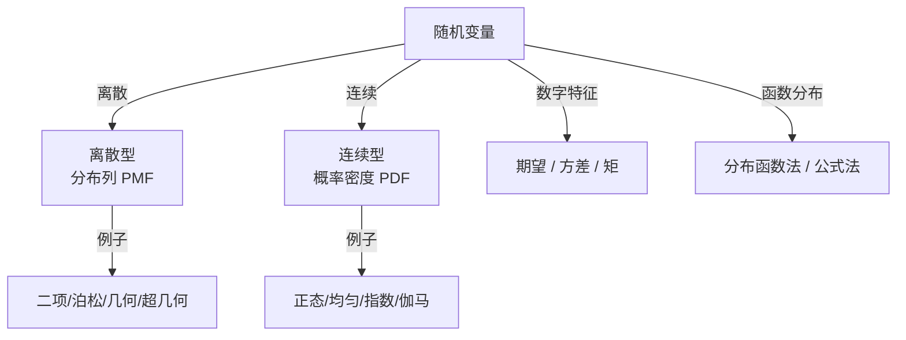

# 一维随机变量

随机变量将样本空间 $\Omega$ 上的事件映射为实数，从而可以用微积分和实分析的工具来研究概率。本章涵盖分布函数、常用分布、数字特征和变量函数分布。

## 子主题

- [分布函数与分布类型](./distribution-function.md)
- [常用离散分布](./discrete-distributions.md)
- [常用连续分布](./continuous-distributions.md)
- [数学期望与方差](./expectation-variance.md)
- [随机变量函数的分布](./function-of-rv.md)
