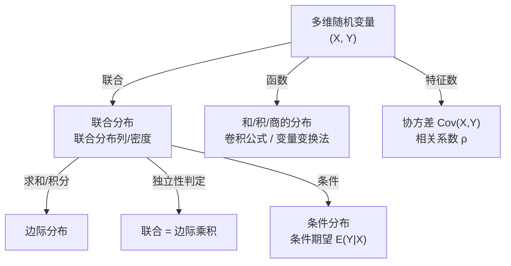

# 多维随机变量

多维随机变量将单个随机变量推广到随机向量。联合分布、边际分布、条件分布以及独立性刻画了各分量之间的关系；协方差和相关系数量化了线性相关程度。

## 子主题

- [联合分布与边际分布](./joint-marginal.md)
- [条件分布与条件期望](./conditional-distribution.md)
- [协方差与相关系数](./covariance-correlation.md)
- [多维变量函数的分布](./multivariate-transformation.md)
