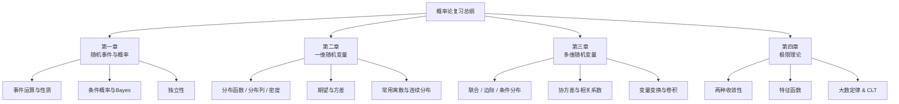

---
sidebar_position: 0
---

# 概率论

概率论是研究随机现象的数学分支。从随机事件与概率公理化出发，逐步建立随机变量、分布理论、数字特征和极限理论，最终连接大数定律与中心极限定理这两大理论高峰。

## 章节导航

### [一、随机事件与概率](./01-random-events/)

从样本空间和事件运算出发，建立概率的公理化定义，涵盖古典概型、几何概型、条件概率、全概率公式、贝叶斯公式和事件独立性。

- [事件运算与概率定义](./01-random-events/event-probability.md)
- [条件概率与三大公式](./01-random-events/conditional-probability.md)
- [独立性](./01-random-events/independence.md)

### [二、一维随机变量](./02-one-dim-random-variable/)

引入随机变量的概念，区分离散型和连续型。学习分布函数（CDF）、常用分布族（二项、泊松、正态、指数等）、数字特征（期望、方差）以及变量函数的分布。

- [分布函数与分布类型](./02-one-dim-random-variable/distribution-function.md)
- [常用离散分布](./02-one-dim-random-variable/discrete-distributions.md)
- [常用连续分布](./02-one-dim-random-variable/continuous-distributions.md)
- [数学期望与方差](./02-one-dim-random-variable/expectation-variance.md)
- [随机变量函数的分布](./02-one-dim-random-variable/function-of-rv.md)

### [三、多维随机变量](./03-multi-dim-random-variable/)

将单个随机变量推广到多维随机向量。联合分布、边际分布、条件分布、独立性判定、协方差与相关系数，以及多维变量函数（卷积、变量变换、次序统计量）。

- [联合分布与边际分布](./03-multi-dim-random-variable/joint-marginal.md)
- [条件分布与条件期望](./03-multi-dim-random-variable/conditional-distribution.md)
- [协方差与相关系数](./03-multi-dim-random-variable/covariance-correlation.md)
- [多维变量函数的分布](./03-multi-dim-random-variable/multivariate-transformation.md)

### [四、大数定律与中心极限定理](./04-limit-theorems/)

概率论的理论顶峰。收敛性概念（依概率、按分布），特征函数工具，大数定律（伯努利、切比雪夫、辛钦）和中心极限定理（林德伯格-莱维、棣莫弗-拉普拉斯）。

- [两种收敛性](./04-limit-theorems/modes-of-convergence.md)
- [特征函数](./04-limit-theorems/characteristic-function.md)
- [大数定律](./04-limit-theorems/law-of-large-numbers.md)
- [中心极限定理](./04-limit-theorems/central-limit-theorem.md)
