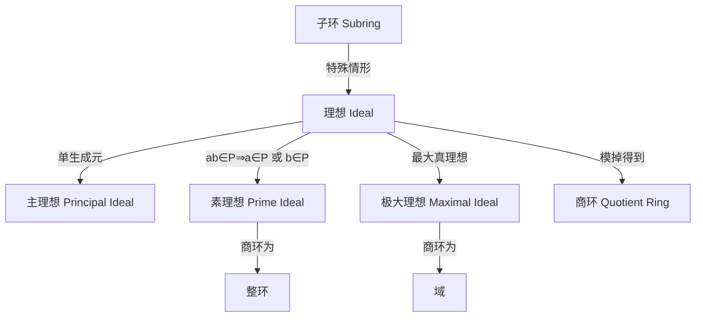

# 子环与理想

子环类比群论中的子群，理想则类比正规子群——理想是构造商环的"正确"子结构。理想是环论中最核心的概念之一。

```mermaid
graph TB
    Sub[子环 Subring] -->|特殊情形| Ideal[理想 Ideal]
    Ideal -->|单生成元| Prin[主理想 Principal Ideal]
    Ideal -->|ab∈P⇒a∈P 或 b∈P| Prime[素理想 Prime Ideal]
    Ideal -->|最大真理想| Max[极大理想 Maximal Ideal]
    Ideal -->|模掉得到| QR[商环 Quotient Ring]
    Prime -->|商环为| ID[整环]
    Max -->|商环为| Field[域]
```

## 子主题

- [子环](./subring.md)
- [理想](./ideal.md)
- [理想的类型：主理想、素理想、极大理想](./ideal-types.md)
