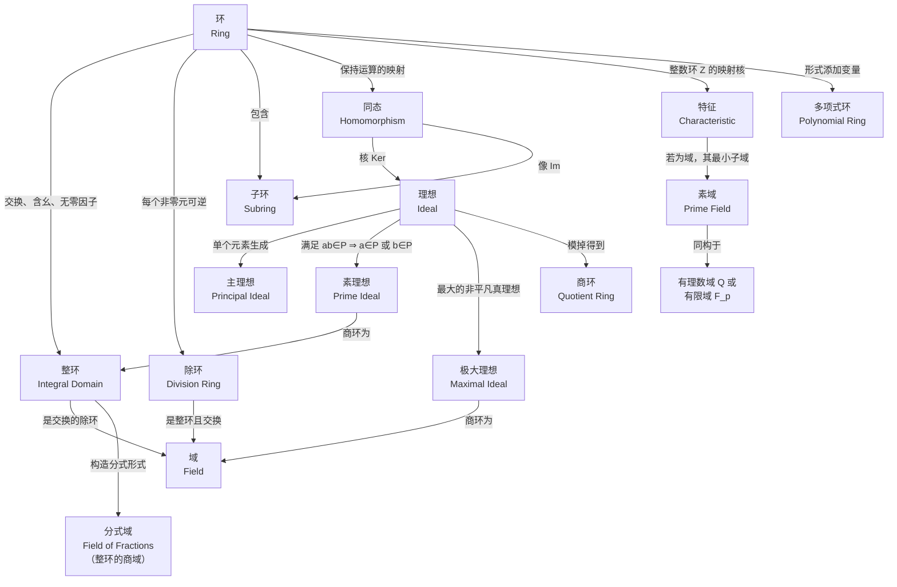

---
sidebar_position: 0
---

# 环论



## 章节导航

### [一、环的基本概念](./basic-concepts/)

从环的公理化定义出发，介绍零因子、可逆元、整环和域等核心概念，建立环的分类体系。

- [环的定义与基本性质](./basic-concepts/ring-definition)
- [整环](./basic-concepts/integral-domain)
- [域](./basic-concepts/field)

### [二、子环与理想](./subring-ideal/)

理想是环论中最重要的子结构——它在环论中的地位类似正规子群在群论中的地位。包含子环、理想、主理想、素理想和极大理想。

- [子环](./subring-ideal/subring)
- [理想](./subring-ideal/ideal)
- [理想的类型：主理想、素理想、极大理想](./subring-ideal/ideal-types)

### [三、环同态与同构](./homomorphism/)

研究环之间保持两种运算的映射——环同态，以及同态基本定理和三大同构定理。

- [环同态](./homomorphism/homomorphism)
- [环同构](./homomorphism/isomorphism)
- [同态基本定理](./homomorphism/fundamental-theorem)

### [四、商环](./quotient-ring/)

由理想构造商环，是环论的核心构造方法。商环的性质与理想的类型（素理想 $\leftrightarrow$ 整环、极大理想 $\leftrightarrow$ 域）紧密相连。

### [五、特征与素域](./characteristic/)

环的特征描述了其加法群的结构。对域而言，特征为 $0$ 或素数，决定了域的最小子域（素域 $\cong \mathbb{Q}$ 或 $\mathbb{F}_p$）。

### [六、多项式环](./polynomial-ring/)

在环上形式添加变量得到的多项式环是最重要的环类之一。域上的多项式环是 PID，且可通过不可约多项式构造域的扩张。

### [七、分式域](./field-of-fractions/)

任意整环可嵌入一个最小的域——分式域。这是从整数构造有理数的推广，也是局部化在"所有非零元"处的特例。
```